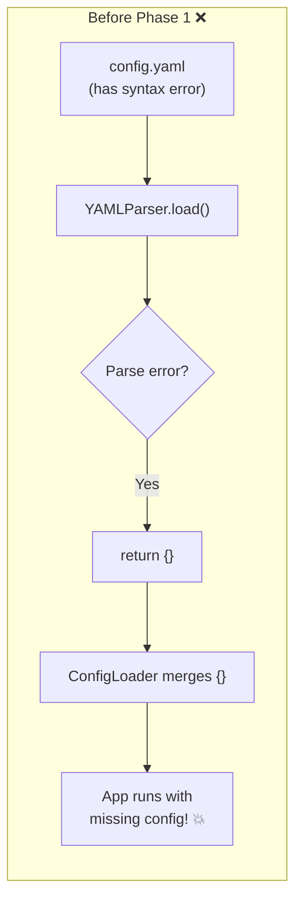
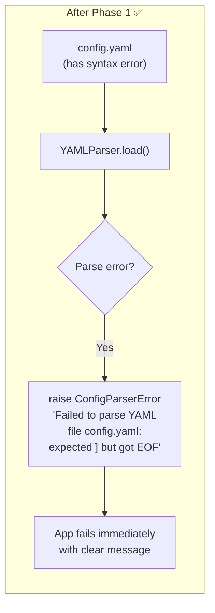
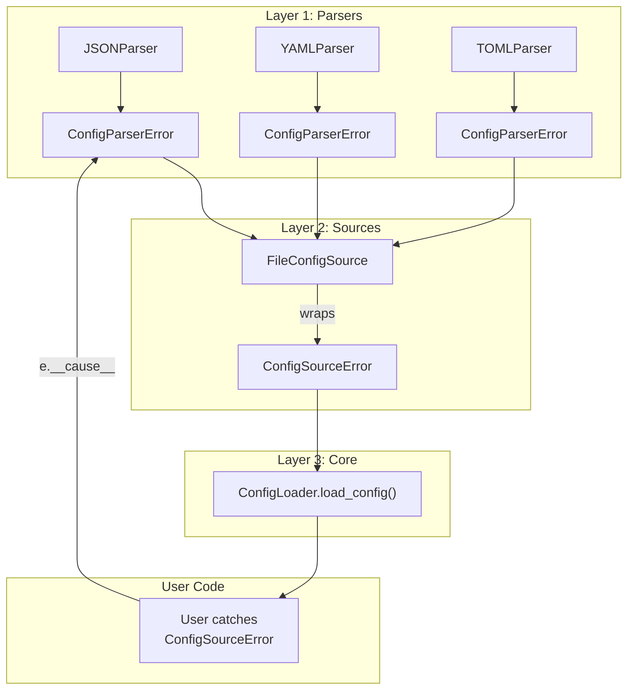
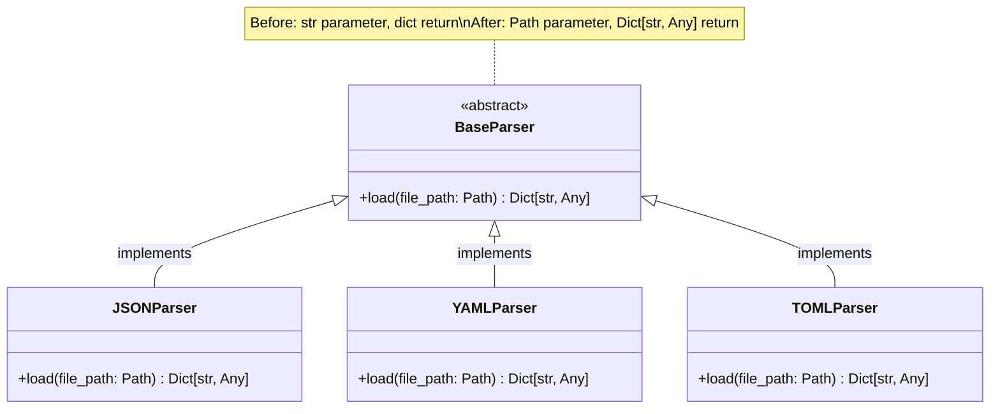
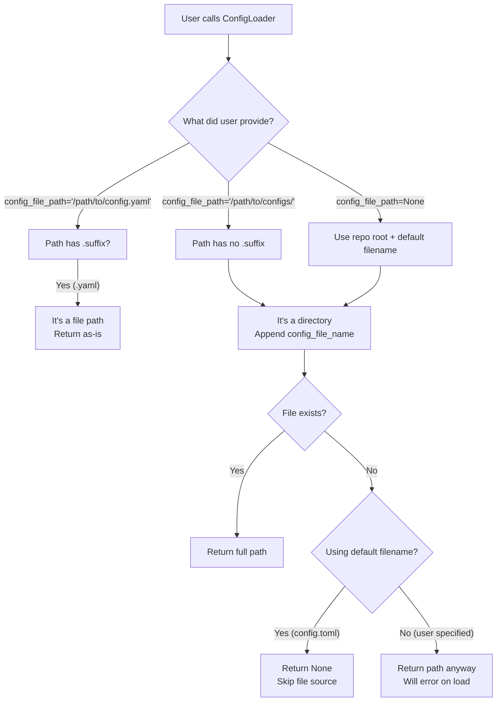
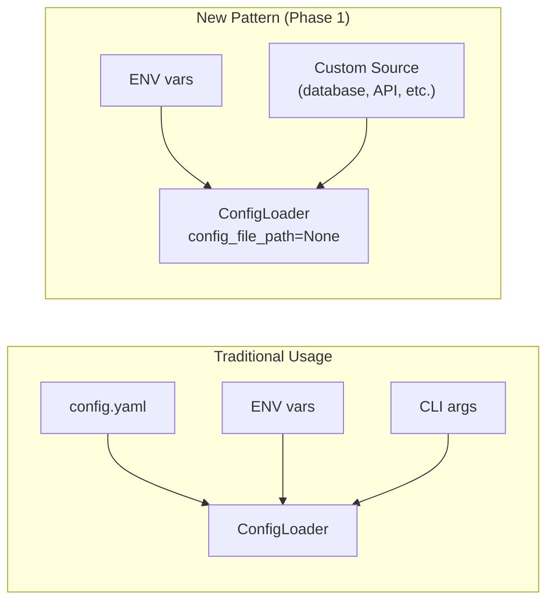
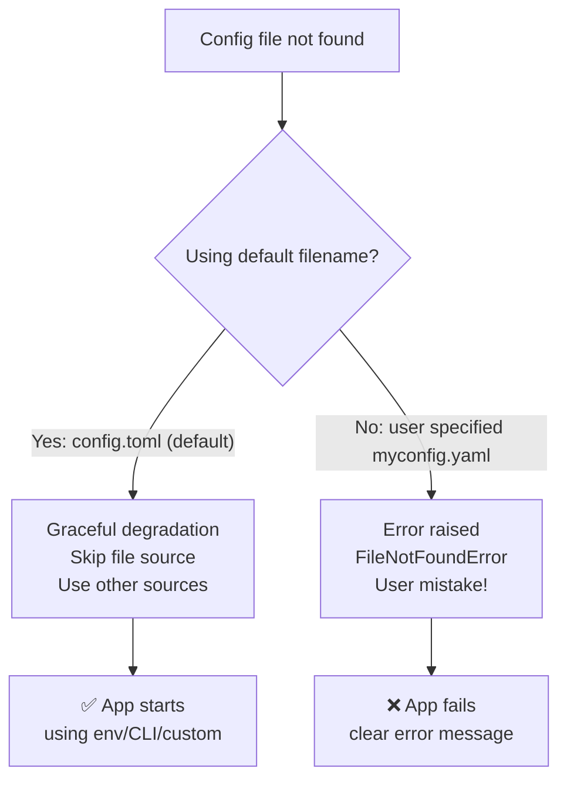

# ConfigLoader Design Decisions & Architecture

> **Purpose**: Quick reference guide for understanding the design choices, patterns, and architecture of ConfigLoader. Read this when returning to the project after a break.

## Table of Contents

- [Architecture Overview](#architecture-overview)
- [Design Patterns](#design-patterns)
- [Core Design Decisions](#core-design-decisions)
- [Configuration Flow](#configuration-flow)
- [Type System Philosophy](#type-system-philosophy)
- [Error Handling Strategy](#error-handling-strategy)
- [Phase 1 Walkthrough: Error Handling Journey](#phase-1-walkthrough-error-handling-journey)

---

## Architecture Overview

### High-Level Flow

```
ConfigLoader (Orchestrator)
    ↓
Sources (Strategy Pattern)
    - FileConfigSource → uses Parser (TOML/YAML/JSON)
    - EnvConfigSource → reads os.environ
    - CLIConfigSource → reads argparse.Namespace
    - CustomSource → user-defined sources
    ↓
Merge Configuration (dict.update() semantics)
    - Later sources override earlier sources
    - Priority: File → Env → CLI → Custom
    ↓
Validate (Optional Pydantic)
    - Only if config_model provided
    - Returns raw dict even after validation
    ↓
Cache (Singleton pattern)
    - Stored in _config attribute
    - reload() method for invalidation
```

### Component Responsibilities

| Component | Responsibility | Location |
|-----------|---------------|----------|
| `ConfigLoader` | Orchestrates loading, merging, validation, caching | `configloader/core.py` |
| `ConfigSource` | Abstract interface for all config sources | `configloader/sources.py` |
| `BaseParser` | Abstract interface for file format parsers | `configloader/parsers/base.py` |
| `FileConfigSource` | Loads from files using appropriate parser | `configloader/sources.py` |
| `EnvConfigSource` | Loads from environment variables | `configloader/sources.py` |
| `CLIConfigSource` | Loads from CLI arguments (argparse) | `configloader/sources.py` |

---

## Design Patterns

### 1. Strategy Pattern (Sources & Parsers)

**Why**: Allows swapping/extending configuration sources without changing core logic.

```python
# All sources implement this interface
class ConfigSource(ABC):
    @abstractmethod
    def load(self) -> Dict[str, Any]:
        pass

# Easy to add custom sources
class DatabaseConfigSource(ConfigSource):
    def load(self) -> Dict[str, Any]:
        return load_from_database()
```

**Benefits:**
- Open/Closed Principle: Open for extension, closed for modification
- Easy to test (mock individual sources)
- Users can inject custom sources

### 2. Singleton Pattern (Caching)

**Why**: Configuration loaded once per application lifecycle, cached for performance.

```python
class ConfigLoader:
    def __init__(self, ...):
        self._config = None  # Cache

    def load_config(self) -> Dict[str, Any]:
        if self._config is None:
            self._config = self._load_and_merge_configs()
        return self._config
```

**Benefits:**
- Fast: No repeated file I/O or parsing
- Consistent: Same config throughout app lifecycle
- Trade-off: Must explicitly `reload()` to update

### 3. Template Method Pattern (Config Loading)

**Why**: Standardizes the loading process while allowing source-specific implementations.

```python
# Template in ConfigLoader
def load_config(self):
    # Step 1: Load from all sources
    # Step 2: Merge configurations
    # Step 3: Validate (optional)
    # Step 4: Cache result
```

---

## Core Design Decisions

### Decision 1: Optional Validation

**Choice**: Pydantic validation is optional, not required.

**Rationale:**
- Library works standalone without Pydantic dependency
- Users choose their own level of strictness
- Simple use cases don't need schemas

**Usage:**

```python
# Without validation (returns raw dict)
loader = ConfigLoader(config_file_name="config.yaml")
config = loader.load_config()  # Dict[str, Any]

# With validation (still returns dict, but validated)
from pydantic import BaseModel

class AppConfig(BaseModel):
    name: str
    debug: bool = False

loader = ConfigLoader(
    config_file_name="config.yaml",
    config_model=AppConfig
)
config = loader.load_config()  # Dict[str, Any], validated against AppConfig
```

---

### Decision 2: Environment Variable Nesting

**Choice**: Support nested configuration via `__` separator in env var names.

**Rationale:**
- Common pattern (Django, FastAPI, 12-factor apps)
- Enables full config specification via environment variables
- Critical for Docker/Kubernetes deployments

**Implementation:**

```python
# Environment variables
MYAPP_DATABASE__HOST=localhost
MYAPP_DATABASE__PORT=5432
MYAPP_DATABASE__USER=admin

# Becomes nested dict
{
  "database": {
    "host": "localhost",
    "port": 5432,      # ← Type coercion (string → int)
    "user": "admin"
  }
}
```

**Type Coercion Rules:**
- `"true"`, `"false"` → `bool`
- `"123"` → `int`
- `"[1,2,3]"` → `list`
- Everything else → `str`

---

### Decision 3: Configuration Source Priority

**Choice**: Later sources override earlier sources (dict.update() semantics).

**Priority Order:**
1. File (base configuration)
2. Environment variables (override for deployment)
3. CLI arguments (override for runtime)
4. Custom sources (override for advanced use cases)

**Rationale:**
- Predictable: Follows dict.update() behavior developers expect
- Flexible: Each layer can override previous layers
- CI/CD friendly: Env vars or CLI can override file config

**Example:**

```python
# config.yaml
database:
  host: localhost
  port: 5432

# Environment
MYAPP_DATABASE__HOST=prod-db

# Result (env overrides file)
{
  "database": {
    "host": "prod-db",  # ← From env
    "port": 5432        # ← From file
  }
}
```

---

### Decision 4: Cache Invalidation

**Choice**: Add `reload()` method while keeping singleton pattern.

**Rationale:**
- Most apps load config once at startup (singleton works)
- Long-running apps or tests need to reload (reload() method)
- Best of both worlds

**API:**

```python
loader = ConfigLoader(config_file_name="config.yaml")

# First load (from sources)
config = loader.load_config()

# Subsequent loads (from cache)
config = loader.load_config()  # Fast, cached

# Force reload
config = loader.reload()  # Re-reads all sources
```

---

### Decision 5: Error Handling Philosophy

**Choice**: Fail fast by default, with opt-in graceful degradation.

**Rationale:**
- Explicit better than implicit
- Silent failures lead to hard-to-debug issues
- Users should know when config is missing

**Implementation:**

```python
# Default: Fail if config file missing
loader = ConfigLoader(config_file_name="config.yaml")
loader.load_config()  # ← Raises ConfigSourceError if file not found

# Opt-in: Graceful degradation
loader = ConfigLoader(
    config_file_name="config.yaml",
    required=False  # ← File is optional
)
loader.load_config()  # ← Returns {} if file not found

# No sources at all: Clear error
loader = ConfigLoader()  # ← No file, no env prefix, no CLI
loader.load_config()
# ConfigLoaderError: No configuration sources provided. Expected at least one of:
#   - Config file at: /path/to/config.toml
#   - Environment variables with prefix (use env_prefix="MYAPP_")
#   - CLI arguments (use cli_args=parser.parse_args())
```

---

### Decision 6: CLI Integration for Downstream Projects

**Choice**: Provide utilities for projects using ConfigLoader to accept CLI overrides.

**Rationale:**
- CI/CD systems often pass config via CLI arguments
- Easier than rewriting entire config file
- Dotted notation is intuitive: `--config.database.host=prod-db`

**Usage in Downstream Projects:**

```python
# In your project that uses configloader
from configloader import ConfigLoader
from configloader.utils import parse_dotted_args
import sys

# Parse CLI args with dotted notation
# python my_app.py --config.database.host=prod-db --config.debug=true
overrides = parse_dotted_args(sys.argv)
# Result: {"database": {"host": "prod-db"}, "debug": True}

# Use as custom source
from configloader.sources import DictConfigSource

loader = ConfigLoader(
    config_file_name="config.yaml",
    custom_sources=[DictConfigSource(overrides)]
)
config = loader.load_config()
```

---

## Configuration Flow

### Step-by-Step Example

```python
# Setup
import os
import argparse
from configloader import ConfigLoader
from pydantic import BaseModel

class AppConfig(BaseModel):
    name: str
    version: str
    debug: bool = False
    database: dict

# 1. Create config file (config.yaml)
"""
name: myapp
version: 1.0.0
debug: false
database:
  host: localhost
  port: 5432
"""

# 2. Set environment variables
os.environ["MYAPP_DATABASE__HOST"] = "prod-db"
os.environ["MYAPP_DEBUG"] = "true"

# 3. Parse CLI arguments
parser = argparse.ArgumentParser()
parser.add_argument("--version", type=str)
args = parser.parse_args(["--version", "2.0.0"])

# 4. Create loader
loader = ConfigLoader(
    config_file_name="config.yaml",
    env_prefix="MYAPP_",
    cli_args=args,
    config_model=AppConfig
)

# 5. Load config
config = loader.load_config()

# Result (merged with priority):
{
  "name": "myapp",              # From file
  "version": "2.0.0",           # From CLI (overrides file)
  "debug": True,                # From env (overrides file)
  "database": {
    "host": "prod-db",          # From env (overrides file)
    "port": 5432                # From file
  }
}
```

---

## Type System Philosophy

### Strict Typing for Library Code

```python
# All functions fully typed
def load(self, path: Path) -> Dict[str, Any]:  # Path not str!
    ...

# Return types are explicit
def load_config(self) -> Dict[str, Any]:  # Not just Dict!
    ...
```

**Why:**
- Catches bugs at development time (mypy)
- Better IDE autocomplete
- Self-documenting code

### Enforced by mypy Configuration

```toml
[tool.mypy]
disallow_untyped_defs = true      # All functions must have types
disallow_incomplete_defs = true   # All args must be typed
warn_return_any = true            # Return Any is flagged
```

### Type Stubs Required

```bash
# Required for external libraries
poetry add --group dev types-PyYAML types-toml
```

---

## Error Handling Strategy

### Exception Hierarchy

```
ConfigLoaderError (Base)
├── ConfigSourceError
│   └── ConfigFileError
├── ConfigParserError
├── ConfigValidationError
└── ConfigMergeError
```

### Error Message Quality

**Bad:**
```python
raise Exception("Error")
```

**Good:**
```python
raise ConfigSourceError(
    f"Error loading configuration from {source.__class__.__name__}: {str(e)}"
)
```

**Best:**
```python
raise ConfigValidationError(
    "Configuration validation failed",
    errors=[
        {"field": "database.host", "message": "Field required"},
        {"field": "version", "message": "Field required"}
    ]
)
```

### When to Raise vs Return

| Scenario | Behavior | Rationale |
|----------|----------|-----------|
| Config file not found (required=True) | Raise ConfigFileError | Fail fast |
| Config file not found (required=False) | Return {} | Graceful degradation |
| Unsupported file format | Raise ConfigParserError | Developer error |
| Validation fails | Raise ConfigValidationError | Invalid config |
| Source fails to load | Raise ConfigSourceError | Unexpected error |
| No sources provided | Raise ConfigLoaderError | Misconfiguration |

---

## Key Takeaways

1. **Extensibility First**: Strategy pattern makes adding new sources/parsers trivial
2. **Flexibility in Validation**: Pydantic is optional, not forced
3. **Predictable Merging**: Later sources override earlier ones (dict.update)
4. **Performance**: Singleton caching with explicit reload
5. **Type Safety**: Full mypy compliance, no `Any` types escaped
6. **Error Clarity**: Fail fast with helpful messages, graceful degradation when opted-in
7. **CI/CD Ready**: Env vars with nesting + CLI overrides for deployment flexibility

---

---

## Phase 1 Walkthrough: Error Handling Journey

> This section documents the error handling improvements made in Phase 1, explaining the "why" behind each change with visual diagrams.

### The Silent Failure Problem

Before Phase 1, ConfigLoader had a critical bug: **parsers silently returned empty dictionaries when config files had syntax errors**.



**Why is this dangerous?**

Imagine your production config file:

```yaml
database:
  host: prod-db.company.com
  port: 5432
  password: [SECRET  # ← Syntax error (unclosed bracket)
```

With the old behavior:
1. Parser catches the YAML error
2. Returns empty `{}`
3. App starts with no database config
4. App crashes later with "database not configured"
5. You spend hours debugging before realizing the YAML was invalid

### The Fix: Fail Fast with Context

After Phase 1, parsers raise `ConfigParserError` with useful information:



**Key improvement:** The error message tells you:
- Which file had the problem
- What format it was (YAML/JSON/TOML)
- What the parse error was (from the underlying library)

### Exception Architecture: The Layered Approach

ConfigLoader uses a **layered exception architecture** where lower-level errors are wrapped with additional context:



**Why wrap exceptions?**

Each layer adds context:

| Layer | Exception | Context Added |
|-------|-----------|---------------|
| Parser | `ConfigParserError` | "Failed to parse JSON file X: ..." |
| Source | `ConfigSourceError` | "Error loading from FileConfigSource: ..." |
| Core | (same, surfaced) | Which source failed |

**User perspective:**

```python
try:
    config = loader.load_config()
except ConfigSourceError as e:
    # What you see:
    # "Error loading configuration from FileConfigSource:
    #  Failed to parse YAML file config.yaml:
    #  expected ',' or ']', but got '<stream end>'"

    # If you need the original error:
    original = e.__cause__  # ConfigParserError
```

### Type Signature Consistency

Phase 1 also fixed inconsistent type signatures across parsers:



**Before:**
```python
def load(self, config_file_path: str) -> dict:  # ❌ Inconsistent
```

**After:**
```python
def load(self, file_path: Path) -> Dict[str, Any]:  # ✅ Consistent
```

**Why does this matter?**

1. **Type safety:** `Path` is more specific than `str`, catches bugs early
2. **Consistency:** Matches the rest of the codebase
3. **Explicitness:** `Dict[str, Any]` shows config structure

### Path Handling: Files vs Directories

The `_get_file()` method had a bug distinguishing file paths from directory paths:



**Key insight:** The fix uses `.suffix` to detect file vs directory:

```python
if self.config_file_path.suffix:  # Has extension like .yaml, .toml
    return self.config_file_path  # It's a file
else:
    # It's a directory, append filename
    return self.config_file_path / self.config_file_name
```

### Optional File Source: Custom Sources Only

Phase 1 enabled a new usage pattern: using ConfigLoader with **only custom sources**:



**Code example:**

```python
# Before Phase 1: Would fail with "config.toml not found"
# After Phase 1: Works perfectly

from configloader import ConfigLoader
from configloader.sources import EnvConfigSource

loader = ConfigLoader(
    config_file_path=None,  # No file!
    custom_sources=[EnvConfigSource(prefix="MYAPP_")]
)

# Loads only from env vars
config = loader.load_config()  # {'database_host': 'localhost', ...}
```

**Use cases:**
- 12-factor apps (env vars only)
- Kubernetes (config from ConfigMaps/Secrets)
- Testing (inject mock config)

### Decision: Default vs Explicit Files

Phase 1 introduced smart handling for missing config files:



**Rationale:**

| Scenario | Behavior | Why |
|----------|----------|-----|
| `ConfigLoader()` with no config.toml | Skip file source | User might only want env vars |
| `ConfigLoader(config_file_name="app.yaml")` with no app.yaml | Error | User explicitly requested this file |

**The distinction matters:**
- If you didn't specify a filename, you might not need a file
- If you explicitly named a file, you expect it to exist

### Error Hierarchy Summary

After Phase 1, the exception hierarchy is:

```
ConfigLoaderError (Base)
├── ConfigSourceError      ← Wraps source failures
│   └── ConfigFileError    ← File-specific errors
├── ConfigParserError      ← Parse failures (JSON/YAML/TOML)
├── ConfigValidationError  ← Pydantic validation errors
└── ConfigMergeError       ← Merge conflicts
```

**When to catch what:**

```python
from configloader.exceptions import (
    ConfigLoaderError,     # Catch-all
    ConfigSourceError,     # Source failed to load
    ConfigParserError,     # Invalid file syntax
    ConfigValidationError, # Schema violation
)

try:
    config = loader.load_config()
except ConfigValidationError as e:
    print(f"Invalid config: {e.errors}")
except ConfigSourceError as e:
    print(f"Source failed: {e}")
except ConfigLoaderError as e:
    print(f"General error: {e}")
```

### Key Takeaways from Phase 1

1. **No silent failures:** Parse errors now raise, not return `{}`
2. **Rich context:** Error messages include file path + details
3. **Exception chaining:** `from e` preserves original stack trace
4. **Consistent types:** All parsers use `Path` + `Dict[str, Any]`
5. **Smart defaults:** Default filename → graceful skip; explicit → error
6. **Optional files:** `config_file_path=None` enables env-only usage

---

**Last Updated**: 2026-02-03
**Version**: 0.2.0 (Phase 1 complete)
